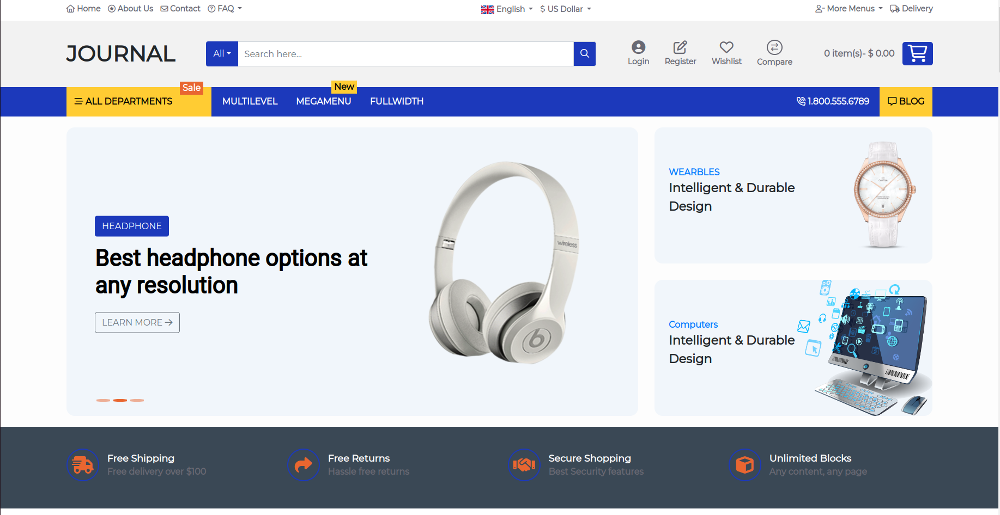
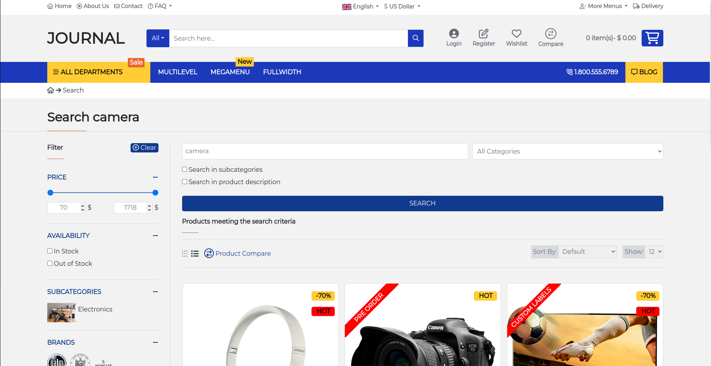
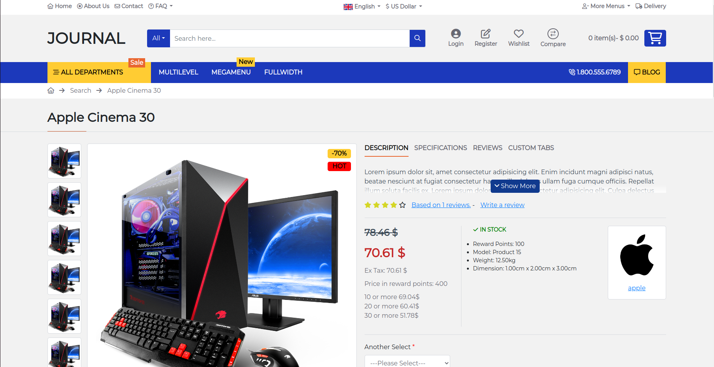

<h1 align="center">
    Ecommerce Website
    
</h1>

### Frontend languages used
- HTML
- CSS
- JavaScript

### Project Description:
Developed the frontend of an e-commerce project using HTML, CSS and JavaScript. 
Static landing page, search page and product page are currently active.

- Live link : <a href="https://w3villa-aman-kumar.github.io/e-commerce/">https://w3villa-aman-kumar.github.io/e-commerce </a>
 

<h3> Landing Page -> </h3>

<h3 style="padding-top:35%;"> Search Page -> </h3>

<h3 style="padding-top:35%;"> Product Page -> </h3>

